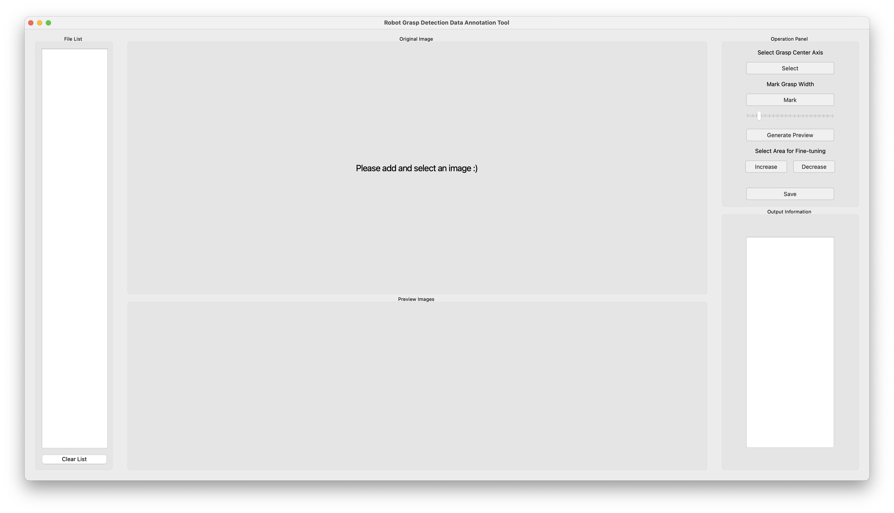

# Robot Grasp Detection Data Annotation Tool

[中文说明](./README_CN.md) | English

## Introduction
A PyQt5-based desktop application designed for annotating robot grasp detection datasets. This tool helps researchers and engineers to annotate grasp positions, angles, and widths on object images, which can be used for training and evaluating robot grasp detection models.

<p align="center">
  
</p>

## Features
- **Interactive Annotation Interface**: User-friendly GUI for grasp annotation
- **Multi-dimensional Grasp Parameters**:
  - Grasp position marking with center axis
  - Grasp angle annotation (-90° to 90°)
  - Grasp width specification (0-150 units)
- **Real-time Quality Visualization**: 
  - Quality heatmap generation for grasp positions
  - Angle visualization with clear indicators
  - Width visualization with adjustable parameters
- **Fine-tuning Capabilities**: 
  - Precise adjustment of grasp quality
  - Interactive modification of grasp parameters
- **Comprehensive File Management**: 
  - Built-in file browser for dataset organization
  - Batch processing support for multiple images
- **Data Export**: Saves annotations in .mat format for machine learning applications

## Project Structure
```
.
├── main.py              # Main entry point
├── QtPage/             
│   ├── MainWindow.py    # Main window implementation
│   ├── ShowView.py      # Data visualization view
│   ├── FileListView.py  # File management view
│   └── ActionView.py    # Action control panel
└── test.py             # Data processing and visualization module
```

## Requirements
- Python >= 3.12
- OpenCV Python >= 4.11.0.86
- PyQt5 >= 5.15.11
- scikit-image >= 0.25.2

## Installation

### Option 1: Using uv (Recommended)
```bash
# Install uv
curl -LsSf https://astral.sh/uv/install.sh | sh

# Clone the repository
git clone https://github.com/styin8/data-collection.git
cd data-collection

# Create and activate virtual environment using uv
uv venv
source .venv/bin/activate  # On Unix/macOS
# or
.venv\Scripts\activate  # On Windows

# Install dependencies using uv sync
uv sync
```

### Option 2: Using pip
```bash
# Clone the repository
git clone https://github.com/styin8/data-collection.git
cd data-collection

# Install dependencies
pip install -r requirements.txt
```

## Usage
1. Start the application:
   ```bash
   python main.py
   ```

2. Interface Components:
   - **File List**: Browse and manage data files
   - **Show View**: Visualize data with various display options
   - **Action Panel**: Control data collection and processing

3. Data Visualization:
   - Quality visualization (0-1 range)
   - Angle visualization (-90° to 90°)
   - Width visualization (0-150 units)
   - Trigonometric decomposition view

## Data Format
The application processes data files with the following specifications:
- Format: .mat
- Shape: (480, 640, 3)
- Channels:
  - Channel 1: Grasp quality (0-1)
  - Channel 2: Grasp angle (-90° to 90°)
  - Channel 3: Grasp width (0-150 units)

## Contributing
Contributions are welcome! Please feel free to submit a Pull Request.

## License
This project is licensed under the MIT License - see the [LICENSE](LICENSE) file for details.

## Contact
If you have any questions or suggestions, please feel free to contact us:
- Email: styin8@gmail.com
- Issue: [Create an issue](https://github.com/styin8/data-collection-master/issues)