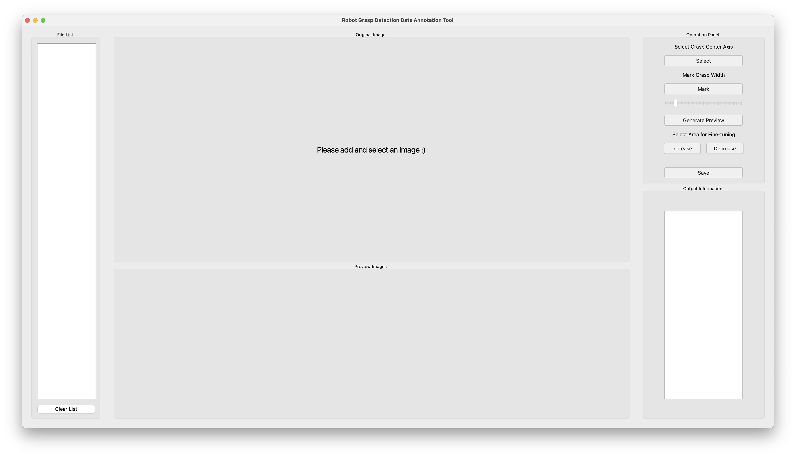

# 机器人抓取检测数据标注工具

中文 | [English](./README.md)

## 简介
这是一个基于 PyQt5 开发的机器人抓取检测数据标注桌面应用程序。该工具帮助研究人员和工程师在物体图像上标注抓取位置、角度和宽度等参数，用于训练和评估机器人抓取检测模型。

<p align="center">
  
</p>

## 功能特点
- **交互式标注界面**：用户友好的图形界面，便于进行抓取标注
- **多维度抓取参数**：
  - 抓取位置中心轴标注
  - 抓取角度标注（-90°到90°）
  - 抓取宽度指定（0-150 单位）
- **实时质量可视化**：
  - 抓取位置质量热力图生成
  - 角度可视化与清晰指示
  - 宽度可视化与参数调节
- **精细调整功能**：
  - 抓取质量精确调整
  - 抓取参数交互式修改
- **完整文件管理**：
  - 内置文件浏览器，便于数据集组织
  - 支持多图片批量处理
- **数据导出**：以 .mat 格式保存标注结果，便于机器学习应用

## 项目结构
```
.
├── main.py              # 主程序入口
├── QtPage/             
│   ├── MainWindow.py    # 主窗口实现
│   ├── ShowView.py      # 数据可视化视图
│   ├── FileListView.py  # 文件管理视图
│   └── ActionView.py    # 动作控制面板
└── test.py             # 数据处理与可视化模块
```

## 环境要求
- Python >= 3.12
- OpenCV Python >= 4.11.0.86
- PyQt5 >= 5.15.11
- scikit-image >= 0.25.2

## 安装方法

### 方式一：使用 uv（推荐）
```bash
# 安装 uv
curl -LsSf https://astral.sh/uv/install.sh | sh

# 克隆仓库
git clone https://github.com/styin8/data-collection.git
cd data-collection

# 使用 uv 创建并激活虚拟环境
uv venv
source .venv/bin/activate  # Unix/macOS系统
# 或
.venv\Scripts\activate  # Windows系统

# 使用 uv sync 安装依赖
uv sync
```

### 方式二：使用 pip
```bash
# 克隆仓库
git clone https://github.com/styin8/data-collection.git
cd data-collection

# 安装依赖
pip install -r requirements.txt
```

## 使用方法
1. 启动应用程序：
   ```bash
   python main.py
   ```

2. 界面组件：
   - **文件列表**：浏览和管理数据文件
   - **显示视图**：通过多种显示选项可视化数据
   - **动作面板**：控制数据采集和处理

3. 数据可视化：
   - 质量可视化（0-1范围）
   - 角度可视化（-90°到90°）
   - 宽度可视化（0-150 单位）
   - 三角函数分解视图

## 数据格式
应用程序处理的数据文件规格如下：
- 格式：.mat
- 形状：(480, 640, 3)
- 通道：
  - 通道1：抓取质量（0-1）
  - 通道2：抓取角度（-90°到90°）
  - 通道3：抓取宽度（0-150 单位）

## 贡献
欢迎提交贡献！请随时提交 Pull Request。

## 许可证
本项目采用 MIT 许可证 - 详见 [LICENSE](LICENSE) 文件。

## 联系方式
如果您有任何问题或建议，请随时联系我们：
- 邮箱：styin8@gmail.com
- 问题：[创建 issue](https://github.com/styin8/Robot-Grasp-Detection-Data-Annotation-Tool/issues) 
